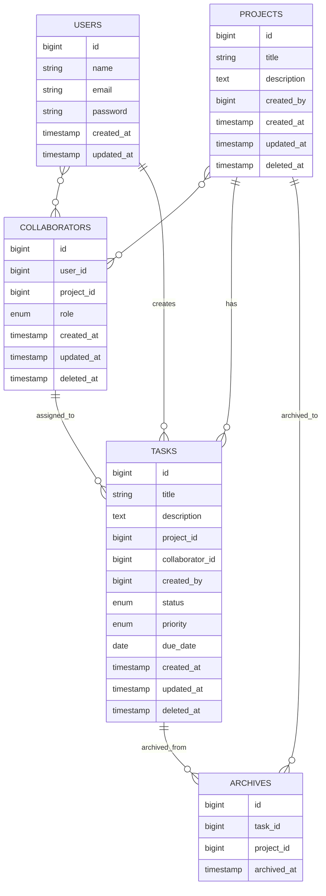

# Database Schema

## MLD Diagram

## Relationships

| Table | Related To | Type |
|-------|------------|------|
| users | projects | Many-to-Many |
| users | tasks | One-to-Many |
| users | collaborators | Many-to-Many |
| projects | collaborators | Many-to-Many |
| projects | tasks | One-to-Many |
| projects | archives | One-to-Many |
| collaborators | tasks | One-to-Many |
| tasks | archives | One-to-Many |

## Notes

- **PK**: Primary Key
- **UK**: Unique Key
- **FK**: Foreign Key
- **Soft Deletes**: projects, collaborators, tasks use `deleted_at`
- **Cascading**: When user is deleted, related records are deleted
- **Nullable**: tasks.project_id and tasks.collaborator_id are nullable
- **Archives**: Stores old_project_id when task is archived
