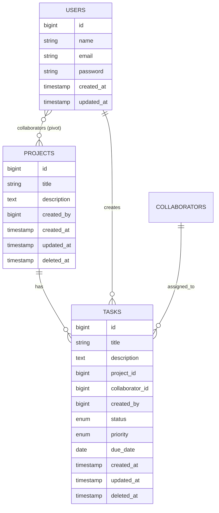

# Database Schema

## MLD Diagram

## Relationships

| Table | Related To | Type |
|-------|------------|------|
| users | projects | Many-to-Many (via collaborators) |
| projects | collaborators | One-to-Many |
| projects | tasks | One-to-Many |
| collaborators | tasks | One-to-Many |
| users | tasks | One-to-Many |

## Notes

- **PK**: Primary Key
- **UK**: Unique Key
- **FK**: Foreign Key
- **Pivot Table**: collaborators (users ↔ projects)
- **Soft Deletes**: projects, collaborators, tasks use `deleted_at`
